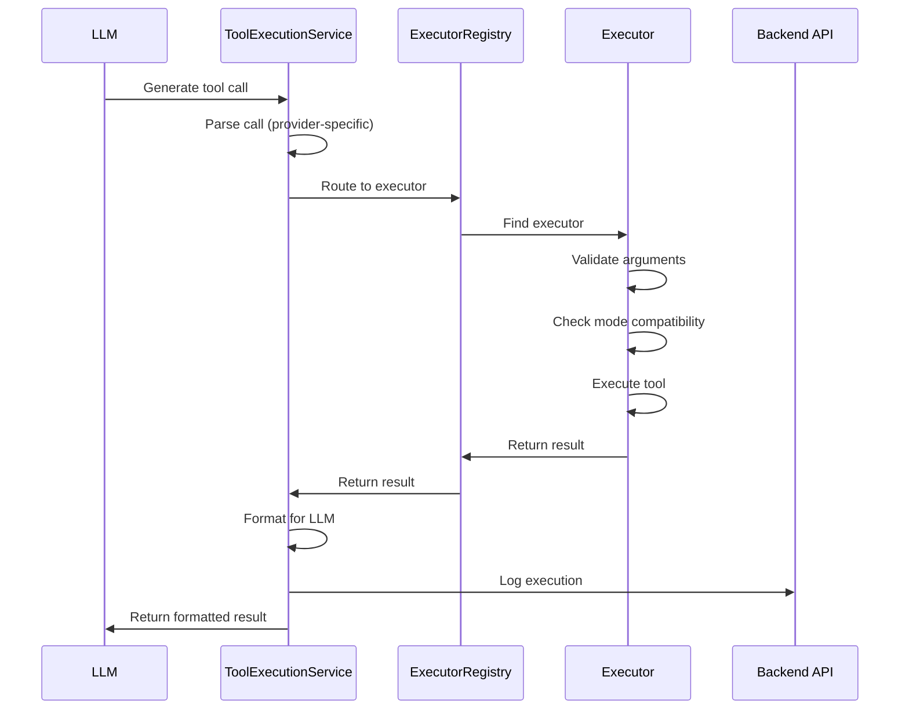

# Model Context Protocol (MCP) Implementation

## Overview

This directory contains the complete implementation of the Model Context Protocol (MCP) for the Alphanetix VS Code extension. The MCP system enables AI models to execute tools within the VS Code environment, providing capabilities for file operations, code search, shell execution, and more.

## Architecture

### Core Components

1. **BaseExecutor** (`executors/BaseExecutor.ts`)
   - Abstract base class for all tool executors
   - Provides validation, error handling, and mode checking
   - Defines the execution lifecycle and context management

2. **ExecutorRegistry** (`executors/ExecutorRegistry.ts`)
   - Singleton registry managing all tool executors
   - Handles tool execution routing and filtering
   - Tracks statistics and compatibility

3. **McpCapabilityService** (`../services/McpCapabilityService.ts`)
   - Loads tool definitions from JSON
   - Registers executors with the registry
   - Communicates with backend APIs

4. **ToolExecutionService** (`../services/ToolExecutionService.ts`)
   - Parses LLM responses (OpenAI, Anthropic, Gemini)
   - Executes tools via ExecutorRegistry
   - Formats results for LLM consumption

## Tool Categories

### Filesystem Tools (8)
- `read_file` - Read file contents with line numbers
- `write_file` - Write/create files with read-first validation
- `edit_file` - String replacement editing
- `multi_edit` - Batch edits to single file (atomic)
- `delete_file` - Delete files with confirmation
- `reapply` - Retry failed edits with smarter model
- `edit_notebook` - Jupyter notebook cell editing
- `ls` - Directory listing with glob filtering

### Search Tools (3)
- `glob` - File pattern matching with fuzzy search
- `grep_search` - Regex pattern search across codebase
- `codebase_search` - Semantic code search

### Shell Tools (3)
- `bash` - Execute shell commands (PowerShell on Windows)
- `bash_output` - Retrieve background process output
- `kill_bash` - Terminate background processes

### Workflow Tools (2)
- `exit_plan_mode` - Transition from planning to coding
- `todo_write` - Manage session task lists

### Web Tools (2)
- `web_fetch` - Fetch and process URL content
- `web_search` - Web search integration

### Visualization Tools (1)
- `create_diagram` - Generate Mermaid diagrams

### Agent Tools (1)
- `task` - Launch specialized sub-agents for complex tasks

## Execution Flow



## Mode-Based Access Control

### ASK Mode (Read-Only)
Limited to safe, non-destructive operations:
- `read_file`, `ls`, `glob`
- `grep_search`, `codebase_search`
- `bash_output`, `exit_plan_mode`
- `todo_write`, `web_fetch`, `web_search`
- `create_diagram`, `task`

### AGENT Mode (Full Access)
All tools available including:
- `write_file`, `edit_file`, `multi_edit`
- `delete_file`, `edit_notebook`, `reapply`
- `bash`, `kill_bash`

## Safety Features

1. **Read-First Validation**: Write and edit operations require prior file reading
2. **User Confirmation**: High-risk operations prompt for user approval
3. **Atomic Operations**: Multi-edit operations rollback on failure
4. **Command Validation**: Shell commands screened for dangerous patterns
5. **Timeout Protection**: Long-running processes have configurable timeouts
6. **Output Truncation**: Large outputs automatically truncated

## Error Handling

Custom error types:
- `ValidationError` - Invalid arguments or preconditions
- `PermissionError` - Mode incompatibility
- `FileNotFoundError` - Missing files or paths
- `ExecutionTimeoutError` - Operation timeout

## Extension Integration

### Initialization
```typescript
// In extension.ts
const mcpService = McpCapabilityService.getInstance();
await mcpService.initialize();
```

### Tool Execution
```typescript
const toolExecService = ToolExecutionService.getInstance();

// Parse tool calls from LLM
const parsed = toolExecService.parseToolCalls(response, 'openai');

// Execute tools
const results = await toolExecService.executeToolCalls(parsed.calls);

// Format for LLM
const formatted = toolExecService.formatResultsForLLM(results, 'openai');
```

## Configuration

Tool definitions are loaded from:
```
AlphanetixAI/alphanetix-mcp-tools-enhanced.json
```

### Tool Definition Schema
```json
{
  "name": "tool_name",
  "version": "1.0.0",
  "category": "filesystem|search|execution|workflow|web|visualization|agent",
  "risk_level": "low|medium|high",
  "execution_type": "fetch|modify",
  "modes": {
    "ask": true,
    "agent": true
  },
  "input_schema": { /* JSON Schema */ },
  "output_schema": { /* JSON Schema */ },
  "transformation_templates": {
    "openai": { /* OpenAI format */ },
    "anthropic": { /* Anthropic format */ },
    "gemini": { /* Gemini format */ }
  }
}
```

## Backend API Integration

### Endpoints
- `POST /api/mcp/capabilities/register` - Register extension capabilities
- `GET /api/mcp/capabilities/intersection` - Get compatible tools
- `POST /api/mcp/capabilities/transform` - Transform tool definitions
- `POST /api/mcp/executions/log` - Log tool execution

## Development Guidelines

### Creating New Executors

1. Extend `BaseExecutor` class
2. Implement `validateArgs()` method
3. Implement `executeInternal()` method
4. Register in `McpCapabilityService`
5. Add tool definition to JSON

Example:
```typescript
export class MyExecutor extends BaseExecutor {
    constructor() {
        super('my_tool', '1.0.0', 'low', 'fetch');
    }

    protected validateArgs(args: MyArgs): void {
        this.validateRequired(args, ['param1']);
        this.validateType(args.param1, 'string', 'param1');
    }

    protected async executeInternal(
        args: MyArgs, 
        context: ExecutionContext
    ): Promise<MyResult> {
        // Implementation
    }
}
```

### Testing Executors

1. Unit test validation logic
2. Test mode compatibility
3. Test error handling
4. Integration test with registry
5. End-to-end test with LLM

## Performance Considerations

- Tool definitions cached after first load
- Executors initialized once (singleton pattern)
- Background processes tracked efficiently
- Output truncation prevents memory issues

## Known Limitations

1. **Process Registry**: `bash_output` and `kill_bash` need shared registry
2. **Web Tools**: Require HTTP client library integration
3. **Reapply**: Needs LLM service integration
4. **Agent Tasks**: Requires backend orchestration system

## Future Enhancements

- [ ] Implement shared process registry
- [ ] Add HTTP client for web tools
- [ ] Integrate LLM service for reapply
- [ ] Build agent orchestration system
- [ ] Add tool usage analytics
- [ ] Implement caching strategies
- [ ] Support custom tool plugins

## Version History

- **v1.0.0** (2025-11-09): Initial implementation with 20 tools

## Contributing

When adding new tools:
1. Create executor in appropriate category folder
2. Add comprehensive validation
3. Implement proper error handling
4. Update tool definition JSON
5. Register in McpCapabilityService
6. Add documentation
7. Write tests

## Support

For issues or questions:
- Extension: VscodePluginAlphanetix repository
- Backend: AlphanetixAI repository
