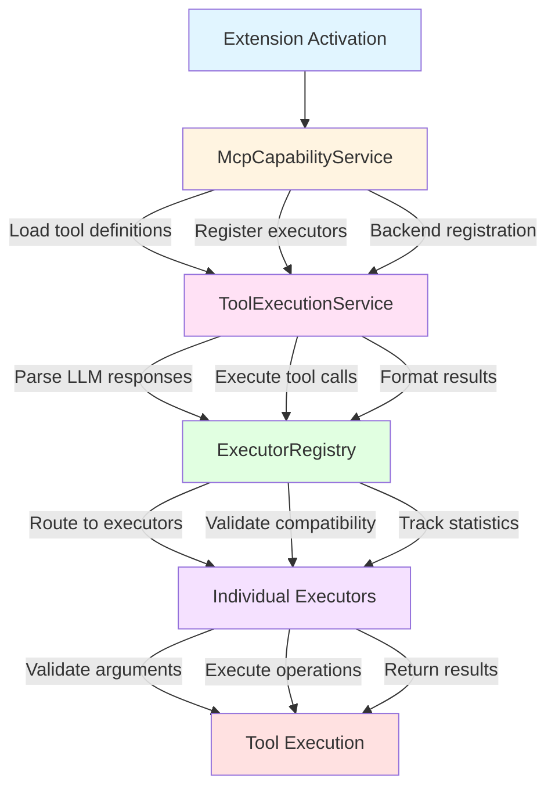
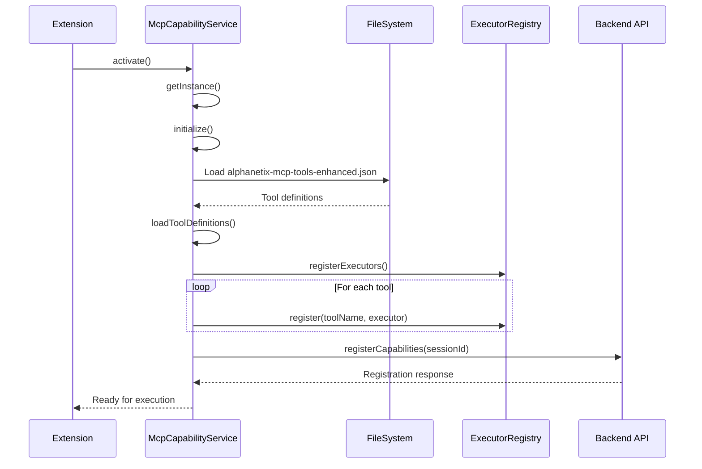
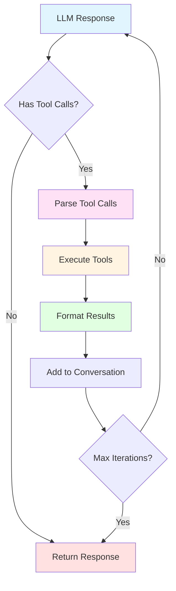

# MCP Services Documentation

## Overview

This document describes the services that orchestrate Model Context Protocol functionality in the Alphanetix VS Code extension.

## Service Architecture



## McpCapabilityService

**Location**: `src/services/McpCapabilityService.ts`

### Purpose
Manages MCP tool definitions and executor registration. Acts as the initialization point for the entire MCP system.

### Key Responsibilities
1. Load tool definitions from JSON
2. Register all executors with ExecutorRegistry
3. Register capabilities with backend API
4. Provide tool transformation services
5. Manage tool availability

### Initialization Flow



**Code Example:**
```typescript
// 1. Extension activation
const mcpService = McpCapabilityService.getInstance();
await mcpService.initialize();

// 2. Load tool definitions
await mcpService.loadToolDefinitions();
// Reads from: AlphanetixAI/alphanetix-mcp-tools-enhanced.json

// 3. Register executors
mcpService.registerExecutors();
// Registers all 20 tool executors

// 4. Ready for tool execution
```

### Public Methods

#### `initialize(): Promise<void>`
Initializes the service by loading tools and registering executors.

```typescript
await mcpService.initialize();
```

#### `loadToolDefinitions(): Promise<void>`
Loads tool definitions from the enhanced JSON file.

```typescript
await mcpService.loadToolDefinitions();
console.log(`Loaded ${mcpService.getAvailableTools().length} tools`);
```

#### `registerCapabilities(sessionId: string): Promise<CapabilityRegistrationResponse>`
Registers extension capabilities with the backend for a session.

```typescript
const response = await mcpService.registerCapabilities(sessionId);
console.log(`Registered ${response.tools.length} tools`);
```

#### `getAvailableTools(): ToolDefinition[]`
Returns all loaded tool definitions.

```typescript
const tools = mcpService.getAvailableTools();
tools.forEach(tool => console.log(tool.name));
```

#### `getTransformedTools(provider: string, sessionId: string): Promise<any[]>`
Gets tool definitions transformed for a specific LLM provider.

```typescript
const openaiTools = await mcpService.getTransformedTools('openai', sessionId);
const anthropicTools = await mcpService.getTransformedTools('anthropic', sessionId);
```

### Backend API Integration

#### Register Capabilities
```http
POST /api/mcp/capabilities/register
Content-Type: application/json

{
  "extensionVersion": "1.0.0",
  "tools": [
    {
      "name": "read_file",
      "version": "1.0.0",
      "modes": ["ask", "agent"]
    }
  ]
}
```

#### Get Intersection
```http
GET /api/mcp/capabilities/intersection?session_id=xxx&mode=agent
```

#### Transform Tools
```http
POST /api/mcp/capabilities/transform
Content-Type: application/json

{
  "provider": "openai",
  "mode": "agent"
}
```

### Configuration

#### Tool Definition Path Resolution
1. Check workspace folders for `../AlphanetixAI/alphanetix-mcp-tools-enhanced.json`
2. Fallback to extension path relative lookup
3. Throw error if not found

#### Version Validation
```typescript
if (toolsData.metadata.min_extension_version > currentVersion) {
  console.warn('Tools require newer extension version');
}
```

### Error Handling

```typescript
try {
  await mcpService.initialize();
} catch (error) {
  vscode.window.showErrorMessage('Failed to initialize MCP tools');
  console.error('MCP initialization failed:', error);
}
```

## ToolExecutionService

**Location**: `src/services/ToolExecutionService.ts`

### Purpose
Handles the execution of tools called by LLMs, including parsing responses, executing tools, and formatting results.

### Key Responsibilities
1. Parse tool calls from LLM responses (provider-specific)
2. Execute tools via ExecutorRegistry
3. Format results for LLM consumption
4. Manage execution context and errors

### Execution Flow



**Code Example:**
```typescript
// 1. Parse LLM response
const parsed = toolExecService.parseToolCalls(llmResponse, 'openai');

// 2. Execute tools
const results = await toolExecService.executeToolCalls(parsed.calls);

// 3. Format for LLM
const formatted = toolExecService.formatResultsForLLM(results, 'openai');

// 4. Continue conversation with results
```

### Public Methods

#### `parseToolCalls(response: unknown, provider: string): ParsedToolCalls | null`
Parses tool calls from LLM response based on provider format.

```typescript
// OpenAI format
const openaiParsed = toolExecService.parseToolCalls(response, 'openai');

// Anthropic format
const anthropicParsed = toolExecService.parseToolCalls(response, 'anthropic');

// Gemini format
const geminiParsed = toolExecService.parseToolCalls(response, 'gemini');
```

#### `executeToolCalls(calls: GenericToolCall[]): Promise<ToolExecutionResult[]>`
Executes multiple tool calls sequentially.

```typescript
const results = await toolExecService.executeToolCalls([
  { id: '1', name: 'read_file', arguments: { file_path: '/path/to/file' } },
  { id: '2', name: 'grep_search', arguments: { pattern: 'TODO' } }
]);
```

#### `executeToolCall(call: GenericToolCall): Promise<ToolExecutionResult>`
Executes a single tool call.

```typescript
const result = await toolExecService.executeToolCall({
  id: 'call_123',
  name: 'read_file',
  arguments: { file_path: '/path/to/file' }
});

console.log(result.success ? result.result : result.error);
```

#### `formatResultsForLLM(results: ToolExecutionResult[], provider: string): unknown[]`
Formats execution results for LLM consumption.

```typescript
// OpenAI format (tool messages)
const openaiFormat = toolExecService.formatResultsForLLM(results, 'openai');

// Anthropic format (tool_result blocks)
const anthropicFormat = toolExecService.formatResultsForLLM(results, 'anthropic');

// Gemini format (functionResponse parts)
const geminiFormat = toolExecService.formatResultsForLLM(results, 'gemini');
```

#### `hasToolCalls(response: unknown, provider: string): boolean`
Checks if LLM response contains tool calls.

```typescript
if (toolExecService.hasToolCalls(response, 'openai')) {
  // Handle tool execution
} else {
  // Handle regular response
}
```

### Provider-Specific Formats

#### OpenAI Format
```typescript
// Request
{
  "choices": [{
    "message": {
      "tool_calls": [{
        "id": "call_123",
        "type": "function",
        "function": {
          "name": "read_file",
          "arguments": "{\"file_path\": \"/path\"}"
        }
      }]
    }
  }]
}

// Response
{
  "role": "tool",
  "tool_call_id": "call_123",
  "name": "read_file",
  "content": "{\"content\": \"file contents...\"}"
}
```

#### Anthropic Format
```typescript
// Request
{
  "content": [{
    "type": "tool_use",
    "id": "toolu_123",
    "name": "read_file",
    "input": { "file_path": "/path" }
  }]
}

// Response
{
  "type": "tool_result",
  "tool_use_id": "toolu_123",
  "content": "{\"content\": \"file contents...\"}",
  "is_error": false
}
```

#### Gemini Format
```typescript
// Request
{
  "candidates": [{
    "content": {
      "parts": [{
        "functionCall": {
          "name": "read_file",
          "args": { "file_path": "/path" }
        }
      }]
    }
  }]
}

// Response
{
  "functionResponse": {
    "name": "read_file",
    "response": { "content": "file contents..." }
  }
}
```

### Context Management

```typescript
// Execution context includes:
interface ExecutionContext {
  toolName: string;
  toolVersion: string;
  mode: 'ask' | 'agent';
  sessionId?: string;
  userId?: string;
}
```

### Error Handling

```typescript
const result = await toolExecService.executeToolCall(call);

if (result.success) {
  console.log('Success:', result.result);
} else {
  console.error('Failed:', result.error);
  console.error('Execution time:', result.executionTime, 'ms');
}
```

## Integration Example

### Complete Multi-Turn Conversation

```typescript
import { McpCapabilityService } from './services/McpCapabilityService';
import { ToolExecutionService } from './services/ToolExecutionService';
import { CompletionService } from './services/CompletionService';

// Initialize services
const mcpService = McpCapabilityService.getInstance();
await mcpService.initialize();

const toolExecService = ToolExecutionService.getInstance();
const completionService = CompletionService.getInstance();

// Get transformed tools for provider
const sessionId = stateManager.getCurrentSessionId();
const tools = await mcpService.getTransformedTools('openai', sessionId);

// Start conversation
let messages = [
  { role: 'user', content: 'Read the file at /path/to/file and summarize it' }
];

let maxIterations = 3;
let iteration = 0;

while (iteration < maxIterations) {
  // Call LLM with tools
  const response = await completionService.createCompletion({
    messages,
    tools,
    tool_choice: 'auto'
  });

  // Check if LLM wants to use tools
  if (toolExecService.hasToolCalls(response, 'openai')) {
    // Parse tool calls
    const parsed = toolExecService.parseToolCalls(response, 'openai');
    
    // Execute tools
    const results = await toolExecService.executeToolCalls(parsed.calls);
    
    // Format results for LLM
    const formattedResults = toolExecService.formatResultsForLLM(results, 'openai');
    
    // Add assistant message and tool results to conversation
    messages.push(response.choices[0].message);
    messages.push(...formattedResults);
    
    iteration++;
  } else {
    // No more tool calls - conversation complete
    console.log('Final response:', response.choices[0].message.content);
    break;
  }
}
```

## Service Configuration

### State Management Integration

```typescript
// Get session context
const sessionId = await stateManager.getCurrentSessionId();
const mode = await stateManager.getSessionMode();
const userId = await stateManager.getUserId();

// Use in tool execution
const context = {
  toolName: 'read_file',
  toolVersion: '1.0.0',
  mode,
  sessionId,
  userId
};
```

### Logging Integration

```typescript
// Tool execution logging
const logData = {
  sessionId,
  toolName: result.toolName,
  toolVersion: toolDefinition.version,
  mode,
  inputParams: call.arguments,
  outputResult: result.result,
  status: result.success ? 'success' : 'failed',
  executionDurationMs: result.executionTime,
  errorMessage: result.error
};

await apiClient.post('/api/mcp/executions/log', logData);
```

## Performance Optimization

### Caching Strategies
- Tool definitions cached after first load
- Executor instances created once (singleton)
- Provider transformations cached per session

### Resource Management
- Output truncation to prevent memory issues
- Timeout controls for long-running operations
- Background process tracking

## Error Recovery

### Service Initialization Failures
```typescript
try {
  await mcpService.initialize();
} catch (error) {
  // Fallback to limited functionality
  console.error('MCP initialization failed, tools unavailable');
  // Continue extension operation without tools
}
```

### Tool Execution Failures
```typescript
const results = await toolExecService.executeToolCalls(calls);

// Individual tool failures don't stop execution
results.forEach(result => {
  if (!result.success) {
    console.error(`Tool ${result.toolName} failed: ${result.error}`);
    // Continue with other tools
  }
});
```

## Testing Services

### Unit Tests
```typescript
describe('McpCapabilityService', () => {
  it('should load tool definitions', async () => {
    await service.loadToolDefinitions();
    expect(service.getAvailableTools().length).toBeGreaterThan(0);
  });
});

describe('ToolExecutionService', () => {
  it('should parse OpenAI tool calls', () => {
    const parsed = service.parseToolCalls(mockResponse, 'openai');
    expect(parsed.calls).toHaveLength(1);
  });
});
```

### Integration Tests
```typescript
describe('MCP Integration', () => {
  it('should execute tool end-to-end', async () => {
    await mcpService.initialize();
    const result = await toolExecService.executeToolCall({
      id: '1',
      name: 'read_file',
      arguments: { file_path: testFilePath }
    });
    expect(result.success).toBe(true);
  });
});
```

## Troubleshooting

### Common Issues

**Tools not loading**
- Check JSON file path resolution
- Verify JSON format validity
- Check version compatibility

**Tool execution failures**
- Verify session context
- Check mode compatibility
- Validate arguments

**Provider format issues**
- Verify provider string ('openai', 'anthropic', 'gemini')
- Check response format matches provider
- Validate transformation templates

## Future Enhancements

- [ ] Parallel tool execution
- [ ] Tool execution retry logic
- [ ] Advanced caching strategies
- [ ] Execution analytics
- [ ] Tool usage quotas
- [ ] Custom tool plugins
